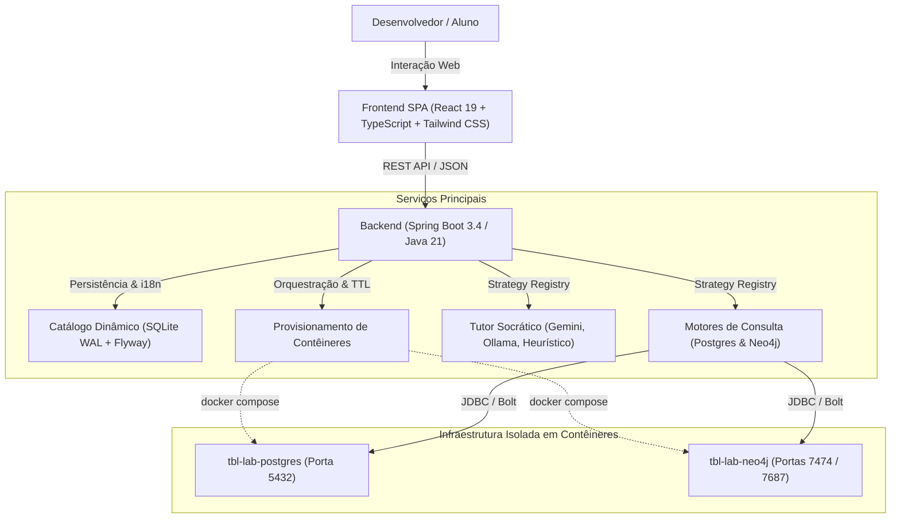

# Tech Book Lab (TBL) 🚀

Plataforma de laboratórios interativos para estudos práticos e aprofundados de livros canônicos de engenharia de software, modelagem de dados, arquiteturas de armazenamento e sistemas distribuídos — iniciando com **"Designing Data-Intensive Applications" (Martin Kleppmann)**.

---

[](https://adoptium.net/)
[](https://spring.io/projects/spring-boot)
[](https://react.dev/)
[](https://www.typescriptlang.org/)
[](https://tailwindcss.com/)
[](https://vitejs.dev/)
[](https://www.docker.com/)
[](https://www.sqlite.org/)

---

## 🎯 Sobre a Plataforma

O **Tech Book Lab** foi projetado para transformar o estudo teórico de literatura técnica avançada em experimentação prática direta. Ao invés de questionários de múltipla escolha com gabaritos rígidos, o desenvolvedor interage com bancos de dados reais e recebe feedback socrático sobre seus trade-offs arquiteturais.

### Principais Recursos
- **Catálogo Dinâmico & Multilíngue:** Livros, capítulos, conceitos-chave e desafios carregados dinamicamente via SQLite com Flyway migrations e suporte nativo a internacionalização (PT-BR e EN).
- **Motores de Execução Pluggáveis (SQL & Cypher):** Execução nativa de consultas em PostgreSQL 16 (relacional/documentos/OLAP) e Neo4j 5 (grafos de propriedades) com mapeamento em tempo real.
- **Tutor Socrático de IA em Tempo Real:** Avaliação interativa via Google Gemini 2.0 Flash, modelos locais com Ollama ou fallback heurístico offline, explorando trade-offs práticos baseados na literatura.
- **Isolamento de Recursos & Ciclo de Vida Inteligente:** Contêineres Docker sob demanda com portas locais determinísticas (`5432` Postgres, `7687`/`7474` Neo4j), monitoramento de inatividade (TTL de 15m) e *teardown* automático ao fechar o laboratório.
- **Workbench Técnico Completo:** Editor de código com atalhos de teclado (`Ctrl + Enter`), visualizador tabular/JSON, reset de schema com 1 clique e indicadores de saúde da infraestrutura.

---

## 🏗️ Visão Geral da Arquitetura

O sistema é estruturado em componentes desacoplados baseados nos padrões **Strategy**, **Registry Lookup** e arquitetura **Local-First Single-User**:



> 📖 Para a documentação técnica aprofundada, diagramas de sequência detalhados e registro de decisões arquiteturais (ADRs), consulte o documento oficial: [**`docs/ARCHITECTURE.md`**](docs/ARCHITECTURE.md).

---

## ⚡ Como Executar o Projeto

### Pré-requisitos
- **Java 21** (JDK LTS)
- **Node.js 20+** e **npm**
- **Docker** e **Docker Compose**

### 1. Iniciar o Backend (Spring Boot)
O backend gerencia o catálogo em SQLite e orquestra a inicialização dos contêineres Docker automaticamente sob demanda.
```bash
cd backend
./mvnw spring-boot:run
```
*(No Windows PowerShell / CMD, utilize `.\mvnw.cmd spring-boot:run`)*  
*A API REST estará disponível em: `http://localhost:8080`*

### 2. Iniciar o Frontend Web (React + Vite)
Em um novo terminal:
```bash
cd frontend
npm install
npm run dev
```
*Acesse a interface da aplicação em: `http://localhost:5173`*

### 3. (Opcional) Subir Contêineres Manualmente
Caso deseje manter os motores de banco previamente iniciados:
```bash
docker compose -f infra/docker-compose.yml up -d
```
- **PostgreSQL 16:** `localhost:5432` (database: `tbl_lab`, user: `tbl_user`)
- **Neo4j 5:** `localhost:7687` (Bolt) / `http://localhost:7474` (Web Browser)

---

## 🤖 Configuração do Tutor de IA

O tutor socrático analisa sua consulta, o resultado retornado pelo banco real e a sua reflexão conceitual sobre trade-offs:

1. **Online Gratuito (Google Gemini - Recomendado):**
   - Obtenha uma chave gratuita no [Google AI Studio](https://aistudio.google.com/).
   - Insira na interface web clicando no ícone do tutor no menu superior, ou configure a variável de ambiente:
     ```bash
     export GEMINI_API_KEY="sua_chave_aqui"
     ```
2. **Local e Privado (Ollama Offline):**
   - Inicie o daemon do Ollama com um modelo leve de código:
     ```bash
     ollama run qwen2.5-coder:1.5b
     ```
   - Selecione **"Ollama Local"** nas configurações da interface.
3. **Modo Heurístico (Zero Config):**
   - Caso nenhuma chave ou servidor local seja fornecido, a plataforma executará automaticamente uma avaliação analítica local baseada em regras estruturadas de engenharia.

---

## 🧪 Testes Automatizados

O projeto adota TDD estrito e cobertura completa de testes em todas as camadas:

```bash
# Executar suíte de testes do Backend (Unitários e de Integração)
cd backend
./mvnw test

# Executar suíte de testes do Frontend (Vitest e Testing Library)
cd frontend
npm test

# Validação de build estrito de produção
cd frontend
npm run build
```

---

## 📄 Licença

Distribuído sob a licença MIT. Consulte `LICENSE` para mais informações.
