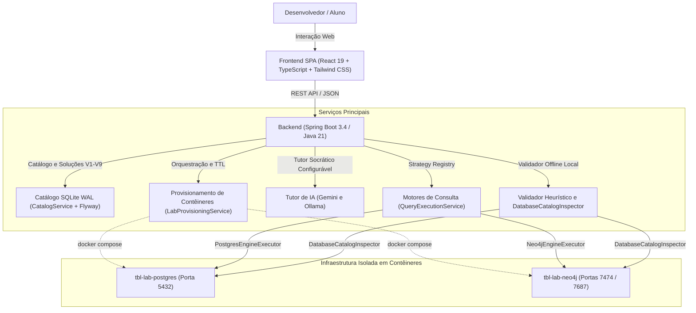

# Tech Book Lab (TBL) 🚀

Plataforma de laboratórios interativos para estudos práticos e aprofundados de livros canônicos de engenharia de software, modelagem de dados, arquiteturas de armazenamento e sistemas distribuídos — iniciando com **"Designing Data-Intensive Applications" (Martin Kleppmann)**.

---

[](https://adoptium.net/)
[](https://spring.io/projects/spring-boot)
[](https://react.dev/)
[](https://www.typescriptlang.org/)
[](https://tailwindcss.com/)
[](https://vitejs.dev/)
[](https://www.docker.com/)
[](https://www.sqlite.org/)

---

## 🎯 Sobre a Plataforma

O **Tech Book Lab** foi projetado para transformar o estudo teórico de literatura técnica avançada em experimentação prática direta. Ao invés de questionários de múltipla escolha com gabaritos rígidos, o desenvolvedor interage com bancos de dados reais e recebe feedback socrático sobre seus trade-offs arquiteturais.

### Principais Recursos
- **Catálogo Dinâmico & Multilíngue (Flyway V1 a V9):** Livros, capítulos, conceitos-chave e desafios carregados dinamicamente via SQLite com Flyway migrations e suporte nativo a internacionalização (PT-BR e EN).
- **Motores de Execução Pluggáveis (SQL & Cypher):** Execução nativa de consultas em PostgreSQL 16 (relacional/documentos/OLAP) e Neo4j 5 (grafos de propriedades) com drivers otimizados (`PostgresEngineExecutor` e `Neo4jEngineExecutor`).
- **Dois Níveis Complementares de Avaliação de Soluções:**
  - **Tutor Socrático de IA Configurável:** Análise interativa via **Google Gemini** (2.5 Flash / 2.0 Flash) ou **Ollama Local** (ex: `qwen2.5-coder`), explorando trade-offs teóricos, análise de planos de execução e recomendações canônicas de Martin Kleppmann.
  - **Validador Heurístico Offline Determinístico:** Avaliação local instantânea com zero chamadas externas de rede, baseada em validação estática de palavras-chave, inspeção determinística do catálogo real dos bancos (`DatabaseCatalogInspector`) e apresentação do gabarito canônico de trade-off (`expected_reflection`) do livro.
- **Autosave Contínuo & Persistência de Progresso:** Salvamento automático das soluções com debounce de 600ms persistido na tabela `challenge_user_solutions`, permitindo alternar entre desafios e retornar ao workspace sem perda de código digitado.
- **Isolamento de Recursos & Ciclo de Vida Inteligente:** Contêineres Docker sob demanda com portas locais determinísticas (`5432` Postgres, `7687`/`7474` Neo4j), health check em tempo real (`GET /api/infra/status`), monitoramento de inatividade (TTL de 15m) e *teardown* automático ao fechar ou trocar de laboratório.
- **Workbench Técnico Completo:** Editor com atalhos de teclado (`Ctrl + Enter`), visualizador tabular e JSON estruturado, cancelamento de consultas ativas (`POST /api/query/cancel`), reset de schema em 1 clique (`POST /api/query/reset/{labId}`) e recarga de starter template limpo.

---

## 🏗️ Visão Geral da Arquitetura

O sistema é estruturado em componentes desacoplados baseados nos padrões **Strategy**, **Registry Lookup** e arquitetura **Local-First Single-User**:



> 📖 Para a documentação técnica aprofundada, diagramas de sequência detalhados e registro de decisões arquiteturais (ADRs), consulte o documento oficial: [**`docs/ARCHITECTURE.md`**](docs/ARCHITECTURE.md).

---

## ⚡ Como Executar o Projeto

### Pré-requisitos
- **Java 21** (JDK LTS)
- **Node.js 20+** e **npm**
- **Docker** e **Docker Compose**

### 1. Iniciar o Backend (Spring Boot)
O backend gerencia o catálogo em SQLite, executa automaticamente as migrações Flyway e orquestra a inicialização dos contêineres Docker sob demanda.
```bash
cd backend
./mvnw spring-boot:run
```
*(No Windows PowerShell / CMD, utilize `.\mvnw.cmd spring-boot:run`)*  
*A API REST estará disponível em: `http://localhost:8080`*

### 2. Iniciar o Frontend Web (React + Vite)
Em um novo terminal:
```bash
cd frontend
npm install
npm run dev
```
*Acesse a interface da aplicação em: `http://localhost:5173`*

### 3. (Opcional) Subir Contêineres Manualmente
Caso deseje manter os motores de banco previamente iniciados:
```bash
docker compose -f infra/docker-compose.yml up -d
```
- **PostgreSQL 16:** `localhost:5432` (database: `tbl_lab`, user: `tbl_user`)
- **Neo4j 5:** `localhost:7687` (Bolt) / `http://localhost:7474` (Web Browser)

---

## 🤖 Avaliação de Desafios: Tutor de IA vs Validação Offline

A plataforma fornece duas formas complementares e independentes para avaliar a solução de cada desafio:

### 1. Tutor Socrático de IA (Online ou Local Privado)
Acessível pelo botão **"Consultar Tutor IA"** e configurável pelo menu **"Configurar Tutor IA"** no topo da tela:
- **Google Gemini (Recomendado):**
  - Obtenha uma chave gratuita no [Google AI Studio](https://aistudio.google.com/).
  - Insira sua chave no modal de configurações da interface e selecione o modelo desejado (ex: `gemini-2.5-flash`).
  - Opcionalmente, defina a variável de ambiente no backend:
    ```bash
    export GEMINI_API_KEY="sua_chave_aqui"
    ```
- **Ollama Local (100% Privado):**
  - Inicie o daemon do Ollama com um modelo de código:
    ```bash
    ollama run qwen2.5-coder:1.5b
    ```
  - Selecione **"Ollama Local"** no modal de configurações.

### 2. Validador Heurístico Offline (Zero Configuração)
Acessível diretamente pelo botão e aba dedicada **"Validação Offline"** no workbench:
- Opera **100% offline** e sem qualquer chave de API ou dependência de provedores de IA.
- Executa validação em duas fases:
  1. **Análise Sintática:** Verifica a presença de comandos estruturais mandatórios (ex: cláusulas de agregação, `JOIN`, nós Cypher).
  2. **Inspeção de Catálogo no Banco Real:** Através do `DatabaseCatalogInspector`, checa se as tabelas, colunas, tipos de dados (`JSONB`, `SERIAL`), Foreign Keys e registros realmente foram criados no PostgreSQL ou Neo4j.
- **Resposta Padrão de Referência de Trade-off:** Ao concluir a validação com sucesso ou necessidade de revisão, exibe a resposta de referência canônica de Martin Kleppmann (`expected_reflection`) para guiar a reflexão arquitetural do desenvolvedor.

---

## 🧪 Testes Automatizados

O projeto adota Test-Driven Development (TDD) estrito e cobertura completa de testes em todas as camadas:

```bash
# Executar suíte de testes do Backend (Unitários e de Integração com H2 e MockMvc)
cd backend
./mvnw test

# Executar linter estrito do Frontend (Zero warnings e zero erros)
cd frontend
npm run lint

# Executar suíte de testes do Frontend (Vitest e Testing Library)
cd frontend
npm test

# Validação de build estrito de produção (TypeScript + Vite)
cd frontend
npm run build
```

---

## 📄 Licença

Distribuído sob a licença MIT. Consulte `LICENSE` para mais informações.
