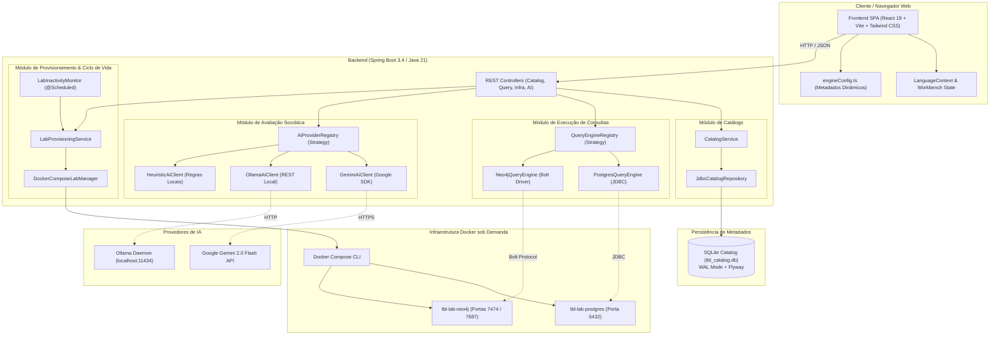
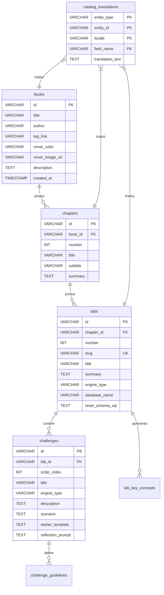
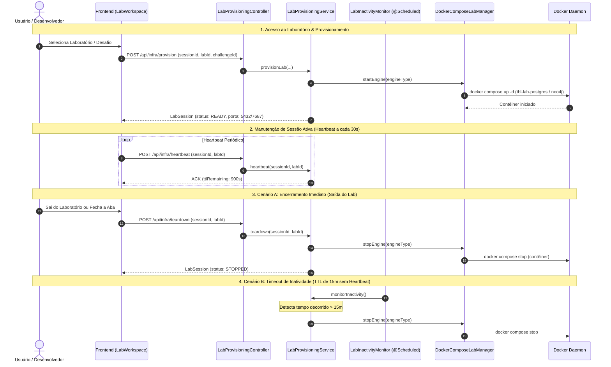
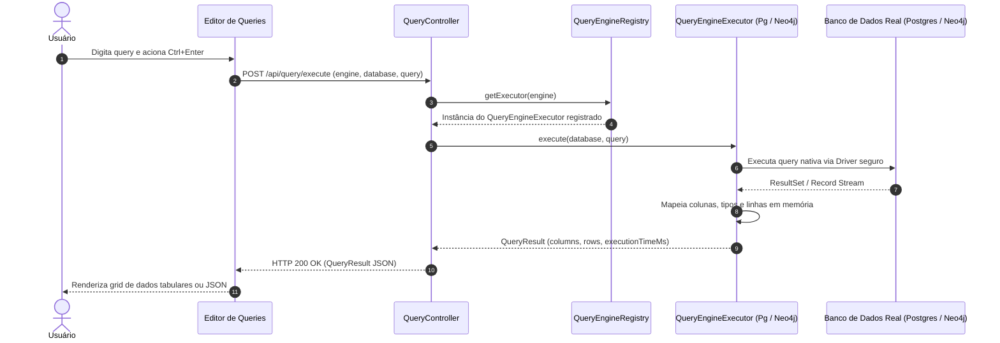
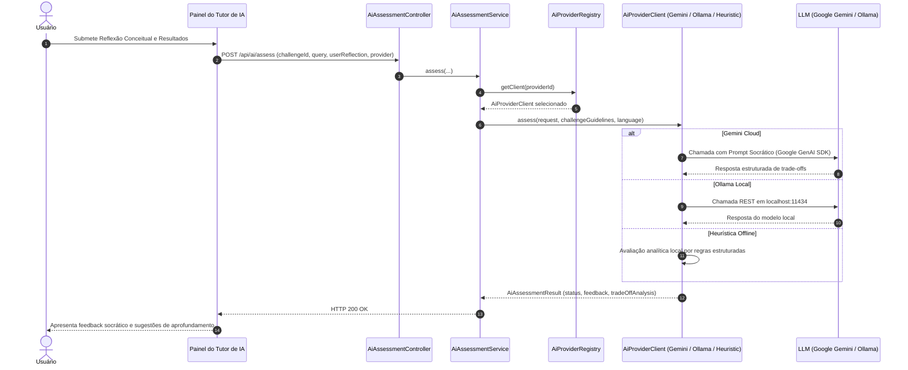

# Arquitetura do Sistema — Tech Book Lab (TBL)

O **Tech Book Lab (TBL)** é uma plataforma educacional interativa projetada para o aprendizado prático e aprofundado de engenharia de software, modelagem de dados, arquiteturas de armazenamento e sistemas distribuídos — fundamentada em obras canônicas como *"Designing Data-Intensive Applications"* (Martin Kleppmann).

Este documento detalha o mapa arquitetural completo da aplicação, as decisões de engenharia adotadas (ADRs), a modelagem de dados, os fluxos de ciclo de vida e os padrões de projeto que sustentam o sistema.

---

## 1. Visão Geral e Mapa de Componentes (C4 Nível 2)

O Tech Book Lab opera em uma arquitetura desacoplada, orientada a componentes, combinando uma interface web reativa, uma API intermediária de governança e orquestração, bancos de dados reais isolados em contêineres e provedores plugáveis de inteligência artificial.

---

## 2. Decisões Arquiteturais Fundamentais (ADRs)

### ADR 01: Arquitetura Single-User Local-First e Portas Determinísticas
- **Contexto**: A plataforma destina-se a estudos individuais onde cada desenvolvedor roda o laboratório diretamente em seu computador pessoal.
- **Decisão**:
  - Evitar a sobrecarga de orquestração multi-tenant (Kubernetes, namespaces dinâmicos, proxies reversos complexos).
  - Alocar portas estáticas previsíveis para os contêineres: PostgreSQL (`5432`) e Neo4j (`7687` Bolt / `7474` Web).
  - Permitir que o aluno inspecione diretamente o banco com ferramentas do seu dia a dia (DBeaver, TablePlus, psql, Neo4j Browser) sem intermediários.
- **Consequências**: Setup trivial, consumo mínimo de recursos e experiência transparente para o desenvolvedor.

### ADR 02: Catálogo Dinâmico em SQLite com WAL Mode e Estratégia de Dupla Inserção (Multilingual)
- **Contexto**: O catálogo de livros, capítulos e laboratórios precisava ser dinâmico, portável, versionável e suportar internacionalização (PT-BR e EN) sem depender de um contêiner de banco adicional rodando permanentemente.
- **Decisão**:
  - Utilizar **SQLite** embarcado com **WAL Mode (Write-Ahead Logging)** gerenciado por migrações versionadas com **Flyway** (V1 a V6).
  - Adotar a **Estratégia de Dupla Inserção** para internacionalização:
    1. *Inserção Canônica*: O conteúdo base é inserido nas tabelas de entidade normalizadas (`books`, `chapters`, `labs`, `challenges`) no idioma canônico padrão (Português).
    2. *Inserção de Tradução*: A tabela `catalog_translations` armazena pares chave-valor traduzidos indexados por `(locale, entity_type, entity_id, field_name)`.
  - A resolução de traduções no `JdbcCatalogRepository` ocorre via *lookup* em memória com fallback automático para o valor canônico caso a chave não possua tradução cadastrada.
- **Consequências**:
  - Schema relacional normalizado e limpo, sem multiplicação de colunas como `title_pt`, `title_en`.
  - Consultas rápidas sem necessidade de explosão de `LEFT JOINs` complexos no banco.
  - Concorrência de leitura totalmente livre de locks devido ao modo WAL.
  - Adição de novos idiomas sem nenhuma alteração estrutural no banco de dados.

### ADR 03: Provisionamento sob Demanda e Ciclo de Vida por Inatividade
- **Contexto**: Manter instâncias de PostgreSQL e Neo4j em execução contínua consome centenas de megabytes de memória RAM e ciclos de CPU desnecessariamente.
- **Decisão**:
  - Contêineres são iniciados sob demanda quando o usuário acessa um laboratório específico (`LabProvisioningService`).
  - Troca dinâmica de motor: se o desafio atual requer Neo4j e o anterior usava Postgres, o contêiner anterior é pausado e o novo é ativado.
  - **Monitoramento de Inatividade (`LabInactivityMonitor`)**:
    - Tarefa em background agendada (`@Scheduled`) verifica a cada 15 segundos o tempo decorrido desde o último acesso.
    - TTL padrão configurável de 15 minutos (`lab.container.inactivity-ttl`).
    - Frontend envia *heartbeat* a cada 30 segundos enquanto a aba do laboratório estiver ativa.
    - **Teardown Imediato**: Quando o usuário desmonta a interface do laboratório ou sai da página (`beforeunload` ou troca de rota), o frontend aciona `POST /api/infra/teardown`, desligando imediatamente os contêineres e liberando os recursos locais.
- **Consequências**: Uso responsável de hardware, viabilizando execução suave mesmo em computadores com recursos limitados.

### ADR 04: Padrão Strategy Desacoplado para Motores de Banco e Provedores de IA
- **Contexto**: A plataforma precisava suportar múltiplos motores de banco de dados heterogêneos (SQL relacional, grafos Cypher, e futuros motores NoSQL/chave-valor) e diferentes provedores de IA (cloud e local).
- **Decisão**:
  - Implementar o padrão **Strategy com Registry Lookup**:
    - `QueryEngineExecutor` + `QueryEngineRegistry`: dispatch em tempo constante `O(1)` para o executor responsável (`PostgresQueryEngine`, `Neo4jQueryEngine`).
    - `AiProviderClient` + `AiProviderRegistry`: dispatch dinâmico para `GeminiAiClient`, `OllamaAiClient` ou `HeuristicAiClient`.
- **Consequências**: Princípio Aberto/Fechado (OCD/SOLID) preservado. Novos bancos de dados ou novos modelos de IA podem ser adicionados sem tocar na lógica dos controladores ou serviços orquestradores.

---

## 3. Modelo de Dados e Catálogo (SQLite + Flyway)

O catálogo técnico é armazenado no arquivo SQLite local `tbl_catalog.db`.

---

## 4. Ciclo de Vida e Provisionamento de Contêineres

O diagrama abaixo ilustra o fluxo completo de inicialização, envio de heartbeat, detecção de inatividade e encerramento antecipado de contêineres:

---

## 5. Execução de Consultas (Pluggable Query Engine)

O fluxo de execução de consultas suporta queries em SQL padrão (PostgreSQL) e consultas em Cypher (Neo4j):

---

## 6. Avaliação Socrática com Tutor de IA (Pluggable AI Strategy)

Ao submeter a query e uma reflexão conceitual, o usuário recebe uma avaliação baseada nos trade-offs reais abordados pelos livros de engenharia:

---

## 7. Arquitetura Frontend (React 19 + TypeScript + Vite)

A interface foi projetada para máxima ergonomia técnica e clareza didática:

- **Gerenciamento de Estado**:
  - `LanguageContext`: provê estado de internacionalização reativo (`pt` / `en`) para textos estáticos da UI e parâmetros de consulta à API.
  - Seleção contextual de Livro, Capítulo e Desafio em nível de raiz (`App.tsx`).
- **Desacoplamento de Configuração de Motores (`engineConfig.ts`)**:
  - Centraliza os metadados visuais (ícones Lucide, títulos, tags de badges e esquemas de cores Tailwind) para cada banco de dados suportado (`POSTGRES`, `NEO4J`), eliminando regras de renderização codificadas nos componentes de tela.
- **Componentes do Workbench**:
  - `Navbar`: alternância de idioma, seletor de IA, tema e status de prontidão dos contêineres.
  - `Sidebar`: árvore hierárquica navegável de capítulos e laboratórios.
  - `Bookshelf`: vitrine visual com cartões dos livros catalogados.
  - `LabWorkspace`: workbench principal contendo editor com syntax highlight, atalho de teclado (`Ctrl + Enter`), visualizador de resultados de query, botão de reset de schema e painel socrático do tutor de IA.
