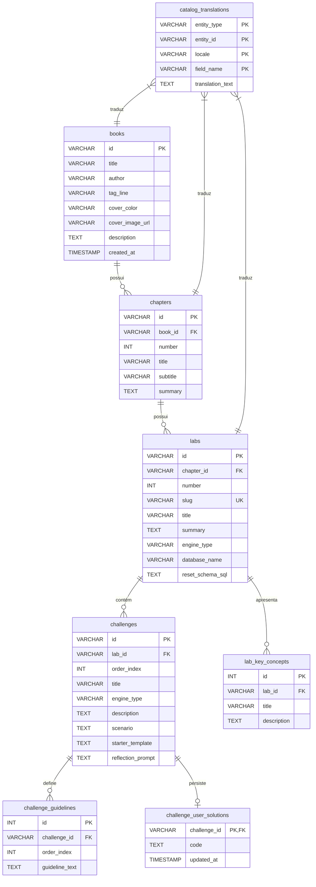
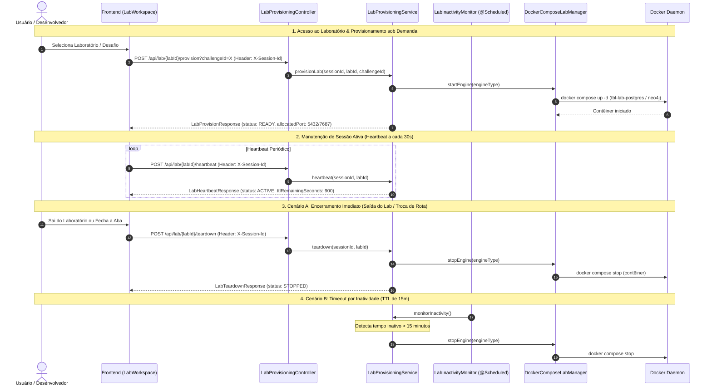
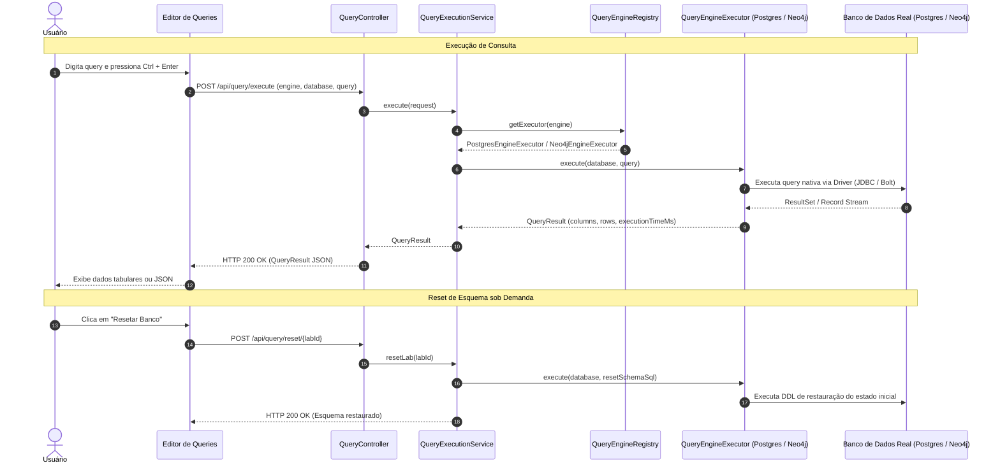
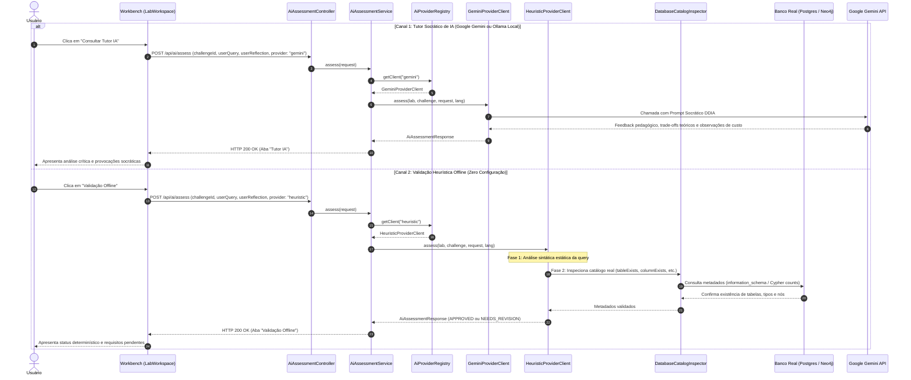

# Arquitetura do Sistema — Tech Book Lab (TBL)

O **Tech Book Lab (TBL)** é uma plataforma educacional interativa projetada para o aprendizado prático e aprofundado de engenharia de software, modelagem de dados, arquiteturas de armazenamento e sistemas distribuídos — fundamentada em obras canônicas como *"Designing Data-Intensive Applications"* (Martin Kleppmann).

Este documento detalha o mapa arquitetural completo da aplicação, as decisões de engenharia adotadas (ADRs), a modelagem relacional de dados, os fluxos de ciclo de vida, a validação de soluções e os padrões de projeto que sustentam o sistema.

---

## 1. Visão Geral e Mapa de Componentes (C4 Nível 2)

O Tech Book Lab opera em uma arquitetura desacoplada, orientada a componentes, combinando uma interface web reativa, uma API intermediária de governança e orquestração em Spring Boot, bancos de dados reais isolados em contêineres Docker sob demanda, um catálogo persistido em SQLite WAL e um subsistema flexível de avaliação socrática e heurística determinística.

```mermaid
graph TD
    subgraph Client["Cliente / Navegador Web"]
        UI["Frontend SPA (React 19 + Vite + Tailwind CSS)"]
        State["LanguageContext & Workbench State"]
        EngineConfig["engineConfig.ts (Metadados Visuais de Motores)"]
        UI --> State
        UI --> EngineConfig
    end

    subgraph BackendApp["Backend (Spring Boot 3.4 / Java 21)"]
        API["REST Controllers (Catalog, LabProvisioning, Query, InfraStatus, AiAssessment)"]
        
        subgraph CatalogModule["Módulo de Catálogo & Soluções"]
            CatService["CatalogService"]
            JdbcRepo["JdbcCatalogRepository"]
            CatService --> JdbcRepo
        end

        subgraph ProvisioningModule["Módulo de Provisionamento & Ciclo de Vida"]
            ProvService["LabProvisioningService"]
            DockerMgr["DockerComposeLabManager"]
            InactivityMon["LabInactivityMonitor (@Scheduled)"]
            InfraStatus["InfraStatusService"]
            ProvService --> DockerMgr
            InactivityMon --> ProvService
        end

        subgraph QueryModule["Módulo de Execução de Consultas"]
            QService["QueryExecutionService"]
            QRegistry["QueryEngineRegistry (Strategy)"]
            PgEngine["PostgresEngineExecutor (JDBC)"]
            NeoEngine["Neo4jEngineExecutor (Bolt Driver)"]
            QService --> QRegistry
            QRegistry --> PgEngine
            QRegistry --> NeoEngine
        end

        subgraph AiModule["Módulo de Avaliação Socrática & Heurística"]
            AiService["AiAssessmentService"]
            AiRegistry["AiProviderRegistry (Strategy)"]
            GeminiClient["GeminiProviderClient (Google GenAI API)"]
            OllamaClient["OllamaProviderClient (REST Local)"]
            HeuristicClient["HeuristicProviderClient (Regras Locais)"]
            CatalogInspector["DatabaseCatalogInspector (Inspeção Real)"]
            AiService --> AiRegistry
            AiRegistry --> GeminiClient
            AiRegistry --> OllamaClient
            AiRegistry --> HeuristicClient
            HeuristicClient --> CatalogInspector
        end

        API --> CatService
        API --> ProvService
        API --> InfraStatus
        API --> QService
        API --> AiService
    end

    subgraph Storage["Persistência de Metadados & Progresso"]
        SQLiteDB[("SQLite (tbl_catalog.db)<br/>WAL Mode + Flyway V1-V8")]
        JdbcRepo --> SQLiteDB
    end

    subgraph EphemeralInfra["Infraestrutura Docker sob Demanda"]
        DockerCLI["Docker Compose CLI"]
        DockerMgr --> DockerCLI
        DockerCLI --> PostgresCont["tbl-lab-postgres (Porta 5432)"]
        DockerCLI --> Neo4jCont["tbl-lab-neo4j (Portas 7474 / 7687)"]
        PgEngine -.->|JDBC| PostgresCont
        NeoEngine -.->|Bolt Protocol| Neo4jCont
        CatalogInspector -.->|Metadados / JDBC / Cypher| PostgresCont
        CatalogInspector -.->|Metadados / Bolt| Neo4jCont
        InfraStatus -.->|Socket Health Check| PostgresCont
        InfraStatus -.->|Socket Health Check| NeoCont
    end

    subgraph ExternalAI["Provedores Externos de IA"]
        GeminiAPI["Google Gemini API (2.5 Flash / 2.0 Flash)"]
        LocalOllama["Ollama Daemon (localhost:11434)"]
        GeminiClient -.->|HTTPS| GeminiAPI
        OllamaClient -.->|HTTP| LocalOllama
    end

    UI -->|HTTP / JSON| API
```

---

## 2. Decisões Arquiteturais Fundamentais (ADRs)

### ADR 01: Arquitetura Single-User Local-First e Portas Determinísticas
- **Contexto**: A plataforma destina-se a estudos individuais em que cada desenvolvedor roda o laboratório diretamente em sua máquina pessoal de desenvolvimento.
- **Decisão**:
  - Evitar a sobrecarga de orquestração multi-tenant (Kubernetes, namespaces dinâmicos, proxies reversos complexos).
  - Alocar portas estáticas previsíveis para os contêineres: PostgreSQL (`5432`) e Neo4j (`7687` Bolt / `7474` Web Browser).
  - Permitir que o aluno inspecione diretamente o banco com ferramentas do seu dia a dia (DBeaver, TablePlus, psql, Neo4j Browser) sem barreiras.
- **Consequências**: Setup trivial, consumo mínimo de memória e experiência de depuração transparente.

### ADR 02: Catálogo Dinâmico em SQLite com WAL Mode, i18n Semântica e Migrações Flyway (V1 a V8)
- **Contexto**: O catálogo de livros, capítulos, laboratórios e desafios precisava ser portável, leve e versionável sem depender de um banco relacional permanente adicional. Além disso, as soluções do aluno precisam ser persistidas continuamente.
- **Decisão**:
  - Utilizar **SQLite** embarcado com **WAL Mode (Write-Ahead Logging)** gerenciado por migrações versionadas com **Flyway**.
  - **Evolução das Migrações (V1 até V8)**:
    1. `V1__create_catalog_tables.sql`: Cria as tabelas canônicas fundamentais (`books`, `chapters`, `labs`, `lab_key_concepts`, `challenges`, `challenge_guidelines`).
    2. `V2__seed_tbl_catalog_data.sql`: Carga de dados didáticos dos laboratórios baseados no livro DDIA (Capítulos 1 a 4).
    3. `V3__add_cover_image_to_books.sql`: Adiciona coluna `cover_image_url` na tabela `books`.
    4. `V4__add_engine_type_to_challenges.sql`: Permite motores heterogêneos por desafio em laboratórios híbridos (ex: SQL relacional no exercício 1 e Neo4j no exercício 2).
    5. `V5__update_starter_templates_idempotent.sql`: Atualiza templates para uso de construções idempotentes (`CREATE TABLE IF NOT EXISTS`).
    6. `V6__add_catalog_translations.sql`: Cria a tabela `catalog_translations` adotando a **Estratégia de Dupla Inserção** para internacionalização (`pt` e `en`) sem fragmentar entidades em colunas duplicadas.
    7. `V7__remove_comments_from_starter_templates.sql`: Higieniza os templates iniciais, mantendo apenas código SQL/Cypher executável sem blocos de comentários redundantes.
    8. `V8__create_challenge_user_solutions.sql`: Cria a tabela `challenge_user_solutions` (`challenge_id`, `code`, `updated_at`) para persistência de progresso e autosave de soluções do usuário.
- **Consequências**:
  - Isolamento transacional e leituras simultâneas sem bloqueios devido ao modo WAL.
  - Esquema limpo, normalizado e com suporte a novos idiomas sem alteração estrutural no banco.
  - Continuidade do aprendizado garantida com armazenamento permanente do código desenvolvido.

### ADR 03: Provisionamento sob Demanda, Heartbeat e Ciclo de Vida por Inatividade
- **Contexto**: Manter instâncias de PostgreSQL e Neo4j ativas em segundo plano degrada a performance da máquina hospedeira.
- **Decisão**:
  - Contêineres são iniciados sob demanda via `POST /api/lab/{labId}/provision` ao acessar um laboratório.
  - Troca dinâmica de motor: se o desafio atual requer Neo4j e o anterior usava Postgres, o contêiner anterior é pausado e o novo é ativado.
  - **Monitoramento de Inatividade (`LabInactivityMonitor`)**:
    - Tarefa em background agendada (`@Scheduled(fixedDelay = 15000)`) verifica o tempo decorrido desde o último acesso.
    - TTL configurável de 15 minutos (`lab.container.inactivity-ttl: 900s`).
    - Frontend envia *heartbeat* via `POST /api/lab/{labId}/heartbeat` a cada 30 segundos enquanto o workspace estiver ativo.
    - **Teardown Imediato**: Ao desmontar a interface do laboratório ou trocar de rota, o frontend aciona `POST /api/lab/{labId}/teardown`, encerrando o contêiner imediatamente.
    - **Health Check em Tempo Real**: `GET /api/infra/status` monitora a conectividade dos sockets em tempo real.
- **Consequências**: Alocação estrita de recursos apenas quando o usuário está estudando ativamente.

### ADR 04: Padrão Strategy Desacoplado para Motores de Banco e Provedores de IA
- **Contexto**: Suportar múltiplos motores de banco de dados (SQL relacional, grafos Cypher e futuros motores NoSQL) e múltiplos provedores de IA sem acoplamento.
- **Decisão**:
  - Motores de Consulta: interface `QueryEngineExecutor` com implementações `PostgresEngineExecutor` e `Neo4jEngineExecutor` registradas em `QueryEngineRegistry`.
  - Provedores de IA: interface `AiProviderClient` com implementações `GeminiProviderClient`, `OllamaProviderClient` e `HeuristicProviderClient` registradas em `AiProviderRegistry`.
- **Consequências**: Aderência estrita ao Princípio Aberto/Fechado (Open/Closed Principle). Novos bancos ou modelos de IA podem ser integrados sem alterar serviços ou controladores.

### ADR 05: Validação Heurística Determinística em Duas Fases (`DatabaseCatalogInspector`)
- **Contexto**: Alunos sem chave do Google Gemini ou sem infraestrutura para rodar Ollama local necessitam de feedback imediato, rigoroso e determinístico, validando se sua solução realmente funcionou no banco de dados.
- **Decisão**:
  - Separar os fluxos conceituais de **Tutor IA** (focado em análise socrática de trade-offs) e **Validação Heurística Offline** (focada em verificação determinística de engenharia).
  - O `HeuristicProviderClient` executa verificação em duas fases:
    1. **Fase 1 (Sintática e Semântica Estática)**: Checagem de construções e palavras-chave mandatórias para o desafio (ex: `JOIN`, `JSONB`, `GROUP BY`, nós e relacionamentos no Cypher).
    2. **Fase 2 (Inspeção Determinística no Catálogo Real)**: O componente `DatabaseCatalogInspector` (`JdbcDatabaseCatalogInspector`) inspeciona o banco real em execução no contêiner, verificando:
       - Existência de tabelas públicas (`tableExists`).
       - Presença de colunas e conformidade de tipos de dados (`columnExists`, ex: `jsonb`, `int`).
       - Restrições de integridade referencial (`foreignKeyExists`).
       - População de registros (`getRowCount`).
       - Criação de nós e relacionamentos rotulados no Neo4j (`countNeo4jNodes`, `countNeo4jRelationships`).
- **Consequências**: O aluno recebe retorno preciso e reprodutível sobre a aderência de sua implementação aos requisitos de engenharia, totalmente offline e sem custo.

### ADR 06: Autosave com Debounce de 600ms e Preservação de Estado Local
- **Contexto**: Durante o estudo de múltiplos desafios, alternar entre exercícios ou recarregar a página sem salvar explicitamente causava frustração e perda de consultas em edição.
- **Decisão**:
  - Implementar autosave no frontend com *debounce* de 600ms após digitação no editor de código.
  - Despachar atualizações via `PUT /api/challenges/{challengeId}/solution` com payload `{ "code": "..." }`.
  - Persistir as soluções na tabela `challenge_user_solutions`.
  - Ao carregar um laboratório, o `CatalogService` preenche o campo `savedCode` de cada desafio, priorizando o código persistido do usuário em relação ao `starterTemplate`.
  - Disponibilizar botão de ação explícita **"Recarregar Template"** para descartar alterações e restaurar o template executável original.
- **Consequências**: Experiência fluida e livre de perdas acidentais de código durante longas sessões de estudo.

---

## 3. Modelo de Dados Relacional (SQLite + Flyway V1-V8)

O esquema relacional é mantido no arquivo SQLite `tbl_catalog.db`:

---

## 4. Ciclo de Vida e Provisionamento de Contêineres

O diagrama abaixo ilustra a orquestração de contêineres, verificação de prontidão, manutenção de sessão via heartbeat e teardown de recursos:

---

## 5. Execução de Consultas (Pluggable Query Engine)

O fluxo de execução atende consultas em SQL relacional (PostgreSQL) e em Cypher (Neo4j), com suporte a cancelamento de consultas ativas e reset de banco:

---

## 6. Avaliação de Desafios: Tutor Socrático de IA vs Validação Offline

A arquitetura provê dois canais de avaliação rigorosos e independentes:

---

## 7. Arquitetura Frontend (React 19 + TypeScript + Vite)

A interface do usuário adota princípios de componentização atômica, tipagem estrita e desacoplamento visual:

- **Gerenciamento de Estado Global & Internacionalização**:
  - `LanguageContext`: provê estado reativo de idioma (`pt` / `en`) para textos de interface e envia o header `Accept-Language` e o parâmetro `?lang=` para as requisições da API.
  - Seleção contextual de Livro, Capítulo e Desafio em nível de aplicação (`App.tsx`).
- **Desacoplamento de Motores (`engineConfig.ts`)**:
  - Centraliza metadados visuais (ícones Lucide, títulos, tags de badges, portas padrão e temas de cores) para cada motor (`POSTGRES`, `NEO4J`, `REDIS`), eliminando regras acopladas dentro de componentes JSX.
- **Autosave com Debounce**:
  - `LabWorkspace` utiliza `useEffect` com timer de 600ms após digitação no editor, chamando `saveChallengeSolution` de forma transparente sem bloquear a interface.
- **Configuração de IA Dedicada (`AiSettingsModal`)**:
  - Exclusivo para provedores configuráveis pelo usuário (**Google Gemini** e **Ollama Local**).
  - O Validador Heurístico Offline não requer configuração de chave nem seleção de modelo, operando nativamente através de sua própria aba e botão dedicado no workbench.
- **Componentes Principais**:
  - `Navbar`: alternância de idioma, seletor de IA, tema visual (claro/escuro), status de prontidão da infraestrutura e navegação rápida para a estante.
  - `Sidebar`: árvore hierárquica de navegação por capítulos e laboratórios com contadores de desafios e numeração dinâmica de seções (§ 1.1, § 3.1).
  - `Bookshelf`: vitrine visual com cartões dos livros técnicos catalogados.
  - `LabWorkspace`: workbench principal contendo editor com suporte a syntax highlighting, atalho `Ctrl + Enter`, visualizador de dados tabulares/JSON, botão de reset de schema, botão de recarregar template e painéis independentes de validação offline e tutor socrático.

---

## 8. Tabela de Referência de Endpoints REST (API Reference)

| Método | Caminho do Endpoint | Descrição Funcional | Código de Sucesso |
| :--- | :--- | :--- | :--- |
| **`GET`** | `/api/books` | Retorna a lista de livros do catálogo dinâmico com suporte a `?lang=` e `Accept-Language`. | `200 OK` |
| **`GET`** | `/api/books/{bookId}` | Retorna detalhes completos do livro, seus capítulos e laboratórios associados. | `200 OK` / `404 Not Found` |
| **`GET`** | `/api/labs/{labId}` | Retorna o laboratório especificado com seus desafios, conceitos-chave e soluções salvas. | `200 OK` / `404 Not Found` |
| **`PUT`** | `/api/challenges/{challengeId}/solution` | Salva a solução de código digitada pelo usuário no desafio (utilizado pelo autosave). | `200 OK` |
| **`DELETE`** | `/api/challenges/{challengeId}/solution` | Remove a solução salva do desafio, restaurando o starter template. | `200 OK` |
| **`POST`** | `/api/lab/{labId}/provision` | Provisiona ou reutiliza contêiner Docker sob demanda para o laboratório e desafio. | `200 OK` / `202 Accepted` |
| **`GET`** | `/api/lab/{labId}/status` | Consulta o status de prontidão e uptime da sessão do contêiner de laboratório. | `200 OK` |
| **`POST`** | `/api/lab/{labId}/heartbeat` | Envia heartbeat de sessão para renovar o TTL de inatividade do contêiner (15m). | `200 OK` |
| **`POST`** | `/api/lab/{labId}/teardown` | Encerra imediatamente o contêiner Docker do laboratório e libera recursos locais. | `200 OK` |
| **`GET`** | `/api/infra/status` | Retorna o status de integridade e conectividade de sockets de todos os motores Docker. | `200 OK` |
| **`POST`** | `/api/query/execute` | Executa instrução SQL (Postgres) ou Cypher (Neo4j) e retorna colunas, linhas e tempo gasto. | `200 OK` |
| **`POST`** | `/api/query/reset/{labId}` | Executa o script DDL canônico do laboratório para restaurar o estado inicial do banco. | `200 OK` |
| **`POST`** | `/api/query/cancel` | Interrompe o processamento de consultas ativas de longa duração no motor. | `200 OK` |
| **`GET`** | `/api/ai/providers` | Lista os provedores de avaliação disponíveis e seus metadados traduzidos. | `200 OK` |
| **`POST`** | `/api/ai/test-connection` | Valida a conectividade e autenticação de um provedor de IA com a chave ou URL informada. | `200 OK` |
| **`POST`** | `/api/ai/assess` | Submete a query e reflexão para avaliação (socrática via LLM ou heurística offline). | `200 OK` / `400 Bad Request` |
