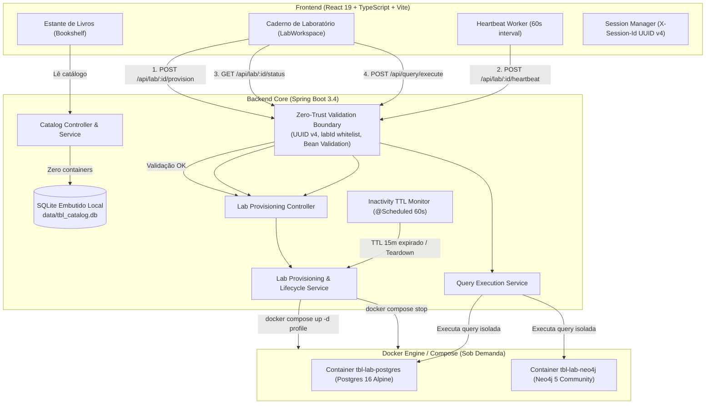

# Especificação Técnica - Issue #24: Segregação de Ambientes, Catálogo Embutido Leve e Provisionamento de Laboratório Sob Demanda com Auto-Stop

## 1. Visão Geral e Motivação

Atualmente, o projeto Tech Book Lab executa contêineres Docker para o catálogo do sistema (`tbl-catalog-db` na porta 5433) e para todos os motores de banco de dados (`tbl-postgres` na 5432 e `tbl-neo4j` na 7687) de forma incondicional e simultânea. Isso impõe:
1. **Sobrecarga de Recursos (RAM e CPU)**: Motores pesados como Neo4j e PostgreSQL ficam ativos mesmo quando o usuário está apenas navegando na estante lendo sobre os livros.
2. **Dependência Forte de Infraestrutura**: O site e a API principal não conseguem iniciar sem contêineres Docker prévios de pé.
3. **Falta de Isolamento e Vulnerabilidade de Superfície**: As consultas interativas dos exercícios práticos não possuem segregação de ciclo de vida clara em relação ao ecossistema base da aplicação.

Esta especificação define:
- **Ambiente Base do Sistema (Core)**: Migração do catálogo de livros, capítulos e desafios para banco de dados relacional embutido em arquivo local (`sqlite-jdbc` / SQLite local persistido em `data/tbl_catalog.db`), permitindo inicialização instantânea e autônoma do site e API sem necessidade de Docker.
- **Ambiente de Laboratório Sob Demanda (Isolated Lab)**: Os motores de banco de dados de prática (`PostgreSQL 16 Alpine` e `Neo4j 5 Community`) passam a ser provisionados sob demanda pelo backend via Docker apenas quando o usuário ingressa em um laboratório específico.
- **Defensiva de Entrada Estrita e Modelagem de Domínio (DDD & Zero-Trust)**: Cada campo de entrada (`labId`, `X-Session-Id`, `engineType`) é rigidamente tipado, limitado em tamanho e validado sintática e semanticamente contra o catálogo antes de qualquer ação no sistema operacional ou no Docker, impedindo injeção de comandos, path traversal e exaustão de recursos.
- **Ciclo de Vida com Heartbeat e Auto-Stop**: Associação da instância do laboratório a um `sessionId` (gerado no frontend e persistido em `localStorage`), mantido ativo por heartbeats da interface a cada 60s enquanto o usuário estiver ativo na página, e encerrado automaticamente após 15 minutos de inatividade real ou imediatamente ao retornar à Estante de Livros.

---

## 2. Arquitetura de Ambientes e Segregação



---

## 3. Modelagem de Domínio e Invariantes Defensivas (DDD & Zero-Trust)

### 3.1 Invariantes de Entrada e Value Objects

Todo dado vindo de fora da fronteira de aplicação é considerado não confiável e deve ser rigorosamente delimitado e validado:

1. **`SessionId` (Value Object)**:
   - **Formato**: Obrigatório formato UUID v4 canônico em minúsculas ou maiúsculas.
   - **Regex Estrito**: `^[0-9a-fA-F]{8}-[0-9a-fA-F]{4}-[1-5][0-9a-fA-F]{3}-[89abAB][0-9a-fA-F]{3}-[0-9a-fA-F]{12}$`
   - **Tamanho Exato**: 36 caracteres.
   - **Regra de Defesa**: Impede caracteres de escape, caminhos relativos (`../`), quebras de linha e strings arbitrárias. Caso viole o formato, lança `DomainValidationException` resultando em HTTP 400 ProblemDetail (RFC 7807):
     - `detail: "O header 'X-Session-Id' é obrigatório e deve ser um UUID v4 canônico válido."`

2. **`LabId` (Value Object)**:
   - **Formato**: Apenas caracteres alfanuméricos minúsculos e hífens.
   - **Regex Estrito**: `^[a-z0-9-]+$`
   - **Tamanho Permitido**: Mínimo 3 e máximo 60 caracteres.
   - **Validação Semântica de Catálogo**: O `labId` DEVE existir no banco do catálogo (`catalogRepository.findLabById(labId)`).
   - **Regra de Defesa**: Nenhuma instrução de provisionamento é despachada para o sistema de contêineres sem que o laboratório seja reconhecido pelo catálogo. Caso não exista, retorna HTTP 404 ProblemDetail:
     - `detail: "Laboratório 'ddia-cap-99-lab-99' não foi encontrado no catálogo técnico."`

3. **`EngineType` (Enum de Domínio Imutável)**:
   - Valores permitidos: `EngineType.POSTGRES`, `EngineType.NEO4J`.
   - **Prevenção de Command Injection no Docker**: O nome do serviço Docker disparado nunca é parametrizado a partir de strings livres do usuário. O serviço utiliza um mapeamento de enum estático imutável:
     - `EngineType.POSTGRES` -> serviço `postgres`
     - `EngineType.NEO4J` -> serviço `neo4j`
   - Disparo via `ProcessBuilder(List<String> command)` sem interpolação de shell (`sh -c` ou `cmd /c`), garantindo que comandos externos maliciosos sejam impossíveis.

4. **Limite de Concorrência de Laboratórios por Sessão (Anti-DoS Invariant)**:
   - Cada `sessionId` tem cota máxima de **1 laboratório ativo provisionado simultaneamente**.
   - Caso uma sessão requisite o provisionamento de um segundo laboratório diferente (ex: usuário mudou de capítulo), o motor anterior é automaticamente desprovisionado (`teardown`) antes da subida do novo ambiente, garantindo que nenhum usuário possa exaurir os recursos de hardware da máquina hospedeira.

### 3.2 Estados do Ambiente de Laboratório (`LabEnvironmentStatus`)

```
   ┌─────────────────┐
   │ NOT_PROVISIONED │
   └────────┬────────┘
            │ POST /api/lab/:id/provision (validado)
            ▼
   ┌─────────────────┐       Timeout (45s) / Erro Docker
   │  PROVISIONING   ├──────────────────────────────┐
   └────────┬────────┘                              │
            │ Healthcheck OK (JDBC / Bolt)          ▼
            ▼                              ┌─────────────────┐
   ┌─────────────────┐                     │      ERROR      │
   │      READY      │                     └─────────────────┘
   └────────┬────────┘                              ▲
            │ TTL 15m sem heartbeat                 │
            │ ou POST /api/lab/:id/teardown         │
            ▼                                       │
   ┌─────────────────┐                              │
   │    STOPPING     ├──────────────────────────────┘
   └────────┬────────┘
            │ Container Parado
            ▼
   ┌─────────────────┐
   │     STOPPED     │
   └─────────────────┘
```

1. **`NOT_PROVISIONED`**: O motor do laboratório está desligado. O catálogo do site responde imediatamente via SQLite embutido sem uso de Docker.
2. **`PROVISIONING`**: O backend disparou a subida do contêiner e está executando sondagem ativa de healthcheck. A interface exibe overlay de carregamento seguro.
3. **`READY`**: O contêiner respondeu com sucesso na porta correspondente e o esquema inicial foi validado. O editor de consultas é liberado.
4. **`STOPPING` / `STOPPED`**: O contêiner foi parado via teardown explícito ou inatividade de 15 minutos.
5. **`ERROR`**: Falha ao subir o contêiner ou timeout de inicialização (limite de 45s). Exibe mensagem amigável e botão de retry.

### 3.3 Entidade de Sessão de Laboratório (`LabSession`)
- **`sessionId`** (`SessionId`): Identificador anônimo único validado como UUID v4.
- **`labId`** (`LabId`): Identificador validado e verificado no catálogo.
- **`engineType`** (`EngineType`): `POSTGRES` ou `NEO4J`.
- **`status`** (`LabEnvironmentStatus`): Estado atual do ambiente.
- **`lastHeartbeatAt`** (`Instant`): Timestamp do último ping recebido da interface.
- **`allocatedPort`** (`int`): Porta alocada para conexão (5432 para PG, 7687 para Neo4j).
- **`errorMessage`** (`String`, opcional): Detalhes de falha em caso de `ERROR`.

---

## 4. Contratos de API (Endpoints REST & RFC 7807)

Todos os endpoints operam sob o padrão Zero-Trust com validação estrita de entrada via Bean Validation e tipagem forte no Spring Boot. Erros retornam o padrão **RFC 7807 (`ProblemDetail`)** já configurado no `GlobalExceptionHandler`.

### 4.1 Iniciar Provisionamento
- **Método**: `POST`
- **Rota**: `/api/lab/{labId}/provision`
- **Headers Obrigatórios**:
  - `X-Session-Id`: String, formato UUID v4 canônico (`^[0-9a-fA-F]{8}-[0-9a-fA-F]{4}-[1-5][0-9a-fA-F]{3}-[89abAB][0-9a-fA-F]{3}-[0-9a-fA-F]{12}$`), exatamente 36 caracteres.
- **Parâmetros de Caminho (Path Variables)**:
  - `labId`: String, padrão `^[a-z0-9-]+$`, mínimo 3 e máximo 60 caracteres.
- **Corpo da Requisição (Body)**: Nenhum (payload vazio).
- **Respostas de Sucesso**:
  - **202 Accepted** (quando a subida do contêiner foi disparada e está inicializando):
    ```json
    {
      "labId": "ddia-cap-03-lab-01",
      "engineType": "POSTGRES",
      "status": "PROVISIONING",
      "message": "Inicializando contêiner PostgreSQL 16 Alpine sob demanda...",
      "allocatedPort": 5432,
      "estimatedWaitSeconds": 5
    }
    ```
  - **200 OK** (se o contêiner já estiver ativo e `READY` para a mesma sessão):
    ```json
    {
      "labId": "ddia-cap-03-lab-01",
      "engineType": "POSTGRES",
      "status": "READY",
      "message": "Ambiente de laboratório já está ativo e pronto para uso.",
      "allocatedPort": 5432,
      "estimatedWaitSeconds": 0
    }
    ```
- **Respostas de Erro (RFC 7807 ProblemDetail)**:
  - **400 Bad Request** (SessionId ou LabId com formato/tamanho inválido):
    ```json
    {
      "type": "https://api.dataintensive.lab/errors/validation",
      "title": "Erro de Validação de Entrada",
      "status": 400,
      "detail": "O header 'X-Session-Id' é obrigatório e deve ser um UUID v4 canônico válido de 36 caracteres.",
      "instance": "/api/lab/ddia-cap-03-lab-01/provision",
      "timestamp": 1790794800000
    }
    ```
  - **404 Not Found** (Laboratório inexistente no catálogo):
    ```json
    {
      "type": "https://api.dataintensive.lab/errors/not-found",
      "title": "Recurso Não Encontrado",
      "status": 404,
      "detail": "Laboratório 'ddia-cap-99-lab-99' não foi encontrado no catálogo técnico.",
      "instance": "/api/lab/ddia-cap-99-lab-99/provision",
      "timestamp": 1790794800000
    }
    ```
  - **500 Internal Server Error** (Falha do Docker daemon ou timeout ao subir):
    ```json
    {
      "type": "https://api.dataintensive.lab/errors/infrastructure",
      "title": "Falha no Provisionamento de Infraestrutura",
      "status": 500,
      "detail": "Não foi possível inicializar o contêiner PostgreSQL sob demanda no tempo limite de 45 segundos.",
      "instance": "/api/lab/ddia-cap-03-lab-01/provision",
      "timestamp": 1790794800000
    }
    ```

---

### 4.2 Sondar Status do Ambiente (Polling de Prontidão)
- **Método**: `GET`
- **Rota**: `/api/lab/{labId}/status`
- **Headers Obrigatórios**:
  - `X-Session-Id`: UUID v4 canônico (36 caracteres).
- **Parâmetros de Caminho (Path Variables)**:
  - `labId`: `^[a-z0-9-]+$` (`min = 3, max = 60`).
- **Respostas de Sucesso**:
  - **200 OK**:
    ```json
    {
      "labId": "ddia-cap-03-lab-01",
      "engineType": "POSTGRES",
      "status": "READY",
      "allocatedPort": 5432,
      "uptimeSeconds": 24,
      "lastHeartbeatAt": 1790794500000,
      "errorMessage": null
    }
    ```
- **Respostas de Erro (RFC 7807 ProblemDetail)**:
  - **400 Bad Request**: Formato de `X-Session-Id` ou `labId` inválido.
  - **404 Not Found**: Laboratório não encontrado no catálogo.

---

### 4.3 Heartbeat de Presença Ativa (Keep-Alive)
- **Método**: `POST`
- **Rota**: `/api/lab/{labId}/heartbeat`
- **Headers Obrigatórios**:
  - `X-Session-Id`: UUID v4 canônico (36 caracteres).
- **Parâmetros de Caminho (Path Variables)**:
  - `labId`: `^[a-z0-9-]+$` (`min = 3, max = 60`).
- **Respostas de Sucesso**:
  - **200 OK**:
    ```json
    {
      "status": "ACK",
      "labId": "ddia-cap-03-lab-01",
      "ttlRemainingSeconds": 900,
      "lastHeartbeatAt": 1790794860000
    }
    ```
- **Respostas de Erro (RFC 7807 ProblemDetail)**:
  - **400 Bad Request**: Formato de `X-Session-Id` ou `labId` inválido.
  - **404 Not Found**: Laboratório não encontrado ou sessão não possui contêiner alocado.
  - **410 Gone**: Sessão expirada por inatividade superior a 15 minutos (ambiente já foi desligado).

---

### 4.4 Desprovisionamento Explícito (Teardown)
- **Método**: `POST`
- **Rota**: `/api/lab/{labId}/teardown`
- **Headers Obrigatórios**:
  - `X-Session-Id`: UUID v4 canônico (36 caracteres).
- **Parâmetros de Caminho (Path Variables)**:
  - `labId`: `^[a-z0-9-]+$` (`min = 3, max = 60`).
- **Respostas de Sucesso**:
  - **200 OK**:
    ```json
    {
      "labId": "ddia-cap-03-lab-01",
      "status": "STOPPED",
      "message": "Ambiente isolado de laboratório encerrado com sucesso. Recursos liberados."
    }
    ```
- **Respostas de Erro (RFC 7807 ProblemDetail)**:
  - **400 Bad Request**: Formato de `X-Session-Id` ou `labId` inválido.
  - **404 Not Found**: Laboratório não encontrado no catálogo.

---

### 4.5 Executar Consulta em Ambiente Isolado
- **Método**: `POST`
- **Rota**: `/api/query/execute`
- **Headers Obrigatórios**:
  - `X-Session-Id`: UUID v4 canônico (36 caracteres).
- **Corpo da Requisição (Body)**:
  ```json
  {
    "labId": "ddia-cap-03-lab-01",
    "query": "SELECT id, nome FROM usuarios LIMIT 5;"
  }
  ```
  - **Validações no DTO (`QueryRequest`)**:
    - `labId`: `@NotBlank`, `@Size(min = 3, max = 60)`, `@Pattern(regexp = "^[a-z0-9-]+$")`
    - `query`: `@NotBlank`, `@Size(max = 10000)`
- **Respostas de Sucesso**:
  - **200 OK**:
    ```json
    {
      "success": true,
      "columns": ["id", "nome"],
      "rows": [
        {"id": 1, "nome": "Alice"},
        {"id": 2, "nome": "Bob"}
      ],
      "rowCount": 2,
      "executionTimeMs": 14,
      "errorMessage": null
    }
    ```
- **Respostas de Erro (RFC 7807 ProblemDetail)**:
  - **400 Bad Request**:
    - Query sintaticamente inválida, erro retornado pelo motor (tabela inexistente, sintaxe SQL incorreta).
    - `labId` ou `query` em branco ou excedendo limite de caracteres.
  - **404 Not Found**: `labId` não cadastrado no catálogo.
  - **409 Conflict** (Ambiente não está pronto):
    ```json
    {
      "type": "https://api.dataintensive.lab/errors/environment-not-ready",
      "title": "Ambiente de Laboratório Indisponível",
      "status": 409,
      "detail": "O ambiente para o laboratório 'ddia-cap-03-lab-01' não está no estado READY (status atual: PROVISIONING). Aguarde a conclusão do provisionamento.",
      "instance": "/api/query/execute",
      "timestamp": 1790794800000
    }
    ```

---

### 4.6 Catálogo de Livros Técnicos (Consulta Base)
- **Método**: `GET`
- **Rota**: `/api/catalog/books`
- **Headers**: Nenhum (consulta pública sem estado).
- **Respostas de Sucesso**:
  - **200 OK**: Array de livros técnicos com seus metadados, capítulos e laboratórios lidos diretamente do SQLite embutido local (`tbl_catalog.db`).
- **Respostas de Erro (RFC 7807 ProblemDetail)**:
  - **500 Internal Server Error**: Erro interno de leitura do banco embutido.

---

### 4.7 Detalhes de Livro Técnico
- **Método**: `GET`
- **Rota**: `/api/catalog/books/{bookId}`
- **Parâmetros de Caminho (Path Variables)**:
  - `bookId`: `^[a-z0-9-]+$`, mínimo 2 e máximo 50 caracteres.
- **Respostas de Sucesso**:
  - **200 OK**: Objeto detalhado do livro contendo capítulos e desafios.
- **Respostas de Erro (RFC 7807 ProblemDetail)**:
  - **400 Bad Request**: Identificador de livro em formato inválido.
  - **404 Not Found**: Livro não encontrado no catálogo.

---

### 4.8 Detalhes de Ficha de Laboratório
- **Método**: `GET`
- **Rota**: `/api/catalog/labs/{labId}`
- **Parâmetros de Caminho (Path Variables)**:
  - `labId`: `^[a-z0-9-]+$`, mínimo 3 e máximo 60 caracteres.
- **Respostas de Sucesso**:
  - **200 OK**: Objeto contendo os desafios, conceitos fundamentais e motor requerido (`engineType`).
- **Respostas de Erro (RFC 7807 ProblemDetail)**:
  - **400 Bad Request**: Formato de `labId` inválido.
  - **404 Not Found**: Laboratório não encontrado no catálogo.

---

## 5. Implementação Técnica Detalhada

### 5.1 Backend: Banco do Catálogo em SQLite (`data/tbl_catalog.db`)
1. **Dependência**: Adicionar `org.xerial:sqlite-jdbc:3.47.1.0` e dialeto compatível com Spring Data JDBC / Flyway.
2. **Configuração Datasource**:
   - `spring.datasource.url=jdbc:sqlite:data/tbl_catalog.db`
   - `spring.datasource.driver-class-name=org.sqlite.JDBC`
   - `spring.flyway.locations=classpath:db/migration`
3. **Criação de Diretório**: Assegurar que o diretório `data/` seja criado automaticamente na inicialização caso não exista.
4. **Flyway Migrations**: As migrações existentes (`V1`, `V2`, `V3`) são ANSI SQL compatíveis e rodam perfeitamente em SQLite.

### 5.2 Backend: Gerenciador de Contêineres Sob Demanda (`DockerComposeLabManager`)
1. **Interface de Abstração (`LabContainerManager`)**:
   - `void startEngine(EngineType engine);`
   - `void stopEngine(EngineType engine);`
   - `boolean isEngineHealthy(EngineType engine);`
2. **Implementação**:
   - Executa comandos não-bloqueantes via `ProcessBuilder`:
     - Postgres: `docker compose -f infra/docker-compose.yml up -d postgres`
     - Neo4j: `docker compose -f infra/docker-compose.yml up -d neo4j`
     - Stop: `docker compose -f infra/docker-compose.yml stop <service>`
   - Para testes automatizados herméticos, provê `MockLabContainerManager` ativada por profile de teste, garantindo 100% de cobertura sem necessidade de Docker daemon no `./mvnw test`.
3. **Healthcheck Ativo**:
   - PostgreSQL: Tenta obter uma `Connection` via `DriverManager.getConnection("jdbc:postgresql://localhost:5432/tbl_lab", "postgres", "postgrespassword")`.
   - Neo4j: Tenta conectar via Bolt driver na porta 7687.

### 5.3 Backend: Monitor de Inatividade (`LabInactivityMonitor`)
- Executado via `@Scheduled(fixedDelay = 60000)`:
  - Varre as sessões ativas no `LabProvisioningService`.
  - Se `Duration.between(session.getLastHeartbeatAt(), Instant.now()).toMinutes() >= 15`:
    - Executa `stopEngine(session.getEngineType())`.
    - Atualiza status para `STOPPED`.

### 5.4 Frontend: Gerenciador de Sessão e Heartbeat
1. **`src/services/session.ts`**:
   - Criação da função `getSessionId()`:
     - Recupera `localStorage.getItem('tbl_session_id')`.
     - Valida se é um UUID v4 válido (`/^[0-9a-f]{8}-[0-9a-f]{4}-4[0-9a-f]{3}-[89ab][0-9a-f]{3}-[0-9a-f]{12}$/i`). Se corrompido ou ausente, gera um novo `crypto.randomUUID()` e persiste.
   - Injeta o header `X-Session-Id` em todas as chamadas de API.
2. **`src/services/labProvisioning.ts`**:
   - Funções tipadas: `provisionLab(labId)`, `getLabStatus(labId)`, `sendHeartbeat(labId)`, `teardownLab(labId)`.
3. **`LabWorkspace.tsx`**:
   - Adicionar estado:
     - `provisionStatus: 'NOT_PROVISIONED' | 'PROVISIONING' | 'READY' | 'ERROR'`.
     - `provisionMessage: string`.
   - `useEffect` ao entrar no laboratório:
     - Chama `provisionLab(lab.id)`.
     - Se `PROVISIONING`, inicia polling a cada 2s até `READY` ou `ERROR`.
     - Quando `READY`, inicia timer de heartbeat a cada 60s.
     - No retorno de cleanup (`useEffect return`):
       - Limpa polling e timers.
       - Dispara `teardownLab(lab.id)`.
   - Renderização:
     - Caso `PROVISIONING`: exibe painel de espera estilizado com animação `book-shadow`, informando o motor sendo provisionado e impedindo execução prematura de queries.
     - Caso `ERROR`: exibe alerta com botão "Tentar Novamente".
     - Caso `READY`: exibe o ambiente completo desbloqueado.

---

## 6. Plano de Testes TDD (Red-Green-Refactor)

### 6.1 Backend
1. **`CatalogDatabaseTest`**:
   - Valida que `tbl_catalog.db` inicializa e carrega os 5 livros e seus laboratórios via SQLite embutido sem conexões de rede externas.
2. **`LabProvisioningValidationTest`**:
   - Valida rejeição imediata com HTTP 400 ProblemDetail para `X-Session-Id` malicioso ou mal formatado (não-UUID).
   - Valida rejeição imediata com HTTP 404 ProblemDetail para `labId` inexistente no catálogo.
   - Valida sanitização de caracteres em `labId`.
3. **`LabProvisioningServiceTest`**:
   - Valida transição de estados `NOT_PROVISIONED -> PROVISIONING -> READY -> STOPPED`.
   - Valida garantia de concorrência: apenas 1 contêiner ativo por sessão (desprovisiona o anterior ao solicitar novo lab).
   - Valida rejeição de execução de queries se o status for diferente de `READY`.
   - Valida renovação de TTL através do `heartbeat`.
   - Valida expiração automática de sessões após 15 minutos de inatividade sem ping.
4. **`LabProvisioningControllerIntegrationTest`**:
   - Valida endpoints REST `POST /api/lab/{labId}/provision`, `GET /api/lab/{labId}/status`, `POST /api/lab/{labId}/heartbeat`, `POST /api/lab/{labId}/teardown`.

### 6.2 Frontend
1. **`session.test.ts`**:
   - Valida geração, validação e persistência estrita do `sessionId` (UUID v4) no `localStorage`.
2. **`labProvisioning.test.ts`**:
   - Valida chamadas de API com injeção do header `X-Session-Id`.
3. **`LabWorkspace.test.tsx`**:
   - Valida exibição do overlay de provisionamento enquanto o status for `PROVISIONING`.
   - Valida desabilitação dos botões de execução durante o provisionamento.
   - Valida liberação do editor e disparo periódico de heartbeat quando o status mudar para `READY`.
   - Valida disparo de `teardown` quando o componente for desmontado (navegação de volta à estante).

---

## 7. Critérios de Aceitação (DoD)
- [ ] O catálogo base da aplicação opera 100% em SQLite embutido em arquivo local sem necessidade de contêineres Docker de pé.
- [ ] Todo campo de entrada (`X-Session-Id`, `labId`) possui validação rígida de tipo, formato (UUID v4) e existência no catálogo com erro RFC 7807 padronizado.
- [ ] Zero comandos concatenados em shell: nomes de serviços Docker mapeados estritamente por enum imutável.
- [ ] Contêineres de laboratório iniciam sob demanda via Docker apenas ao abrir um laboratório prático.
- [ ] Limite de concorrência respeitado: máximo de 1 laboratório ativo por sessão.
- [ ] Interface exibe feedback visual claro de provisionamento e bloqueia consultas até o motor estar pronto.
- [ ] Heartbeat a cada 60s mantém o ambiente ativo enquanto a página estiver aberta.
- [ ] Inatividade superior a 15 minutos desliga automaticamente o contêiner de laboratório para poupar recursos.
- [ ] Retornar à Estante desprovisiona o contêiner imediatamente.
- [ ] 100% dos testes do backend (`./mvnw test`) e do frontend (`npm test`) passam com sucesso.
